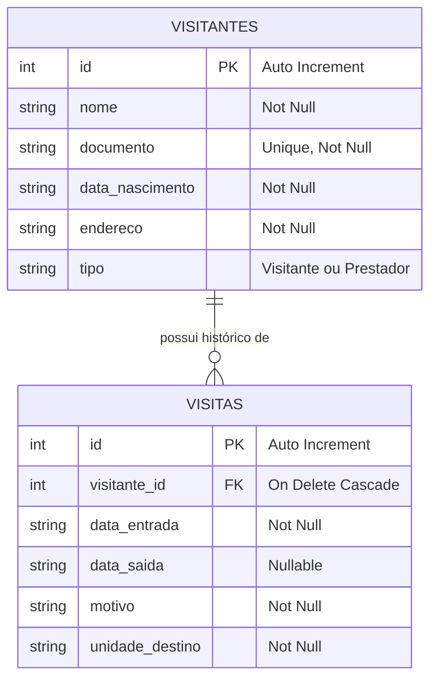
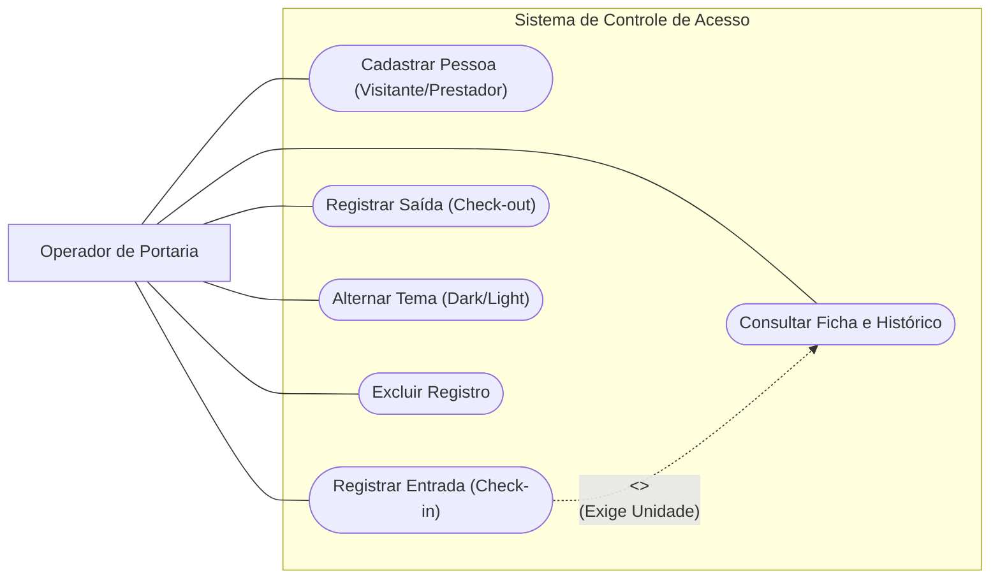
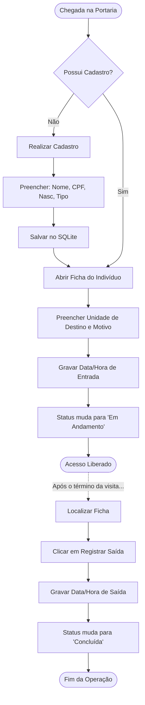

# Sistema de Controle de Acesso - Condomínio

Uma aplicação mobile moderna e robusta focada na **gestão automatizada e segura de portarias e condomínios**. Desenvolvido para substituir os antigos cadernos de registo, este sistema oferece um controlo rigoroso sobre o fluxo de visitantes e prestadores de serviço, garantindo histórico em tempo real, persistência de dados offline e uma interface dinâmica.

A documentação apresentada nesta especificação segue as diretrizes da norma **ISO/IEC/IEEE 29148:2018** para Engenharia de Requisitos.

---

## 1. Introdução e Propósito (ISO 29148)


### 1.1 Objetivo do Sistema

O objetivo primordial deste sistema é informatizar e otimizar a monitorização do fluxo de pessoas em condomínios residenciais ou empresariais. O aplicativo resolve falhas humanas e perda de dados ao garantir que toda entrada possua um destino claro (unidade) e um registo exato de tempo (Check-in e Check-out).

### 1.2 Público-Alvo

Operadores de portaria, recepcionistas, seguranças e síndicos responsáveis pela triagem, identificação e autorização de entrada de indivíduos externos no condomínio.

---

## 2. Descrição Global e Escopo 

O aplicativo funciona de forma totalmente autónoma (*standalone*). O armazenamento de dados de negócio é gerido pelo `sqflite` (banco de dados relacional local), suportando uma relação de cardinalidade de **1:N (Um para Muitos)** entre Cadastros e Visitas. As preferências de interface do utilizador são persistidas através do `shared_preferences`.

---

## 3. Especificação de Requisitos 

### 3.1 Requisitos Funcionais (RF)

| ID | Título | Descrição | Prioridade |
| :--- | :--- | :--- | :--- |
| **RF-001** | Registo de Indivíduos | O sistema deve permitir o registo capturando: Nome, CPF/Documento, Data de Nascimento, Endereço e Tipo (Visitante ou Prestador de Serviço). | Alta |
| **RF-002** | Listagem de Registos | O sistema deve exibir uma lista dinâmica de todos os indivíduos cadastrados, ordenados para rápida localização. | Alta |
| **RF-003** | Visualização da Ficha Detalhada | O sistema deve disponibilizar um perfil para o indivíduo selecionado, expondo os seus dados e o histórico cronológico de acessos. | Alta |
| **RF-004** | Registo de Entrada (Check-in) | O sistema deve permitir anexar um registo de entrada, exigindo obrigatoriamente a Unidade de Destino (Ex: Apto 42) e o Motivo. | Alta |
| **RF-005** | Registo de Saída (Check-out) | O sistema deve permitir atualizar uma visita "Em Andamento", gravando a data e hora exatas da saída. | Alta |
| **RF-006** | Exclusão em Cascata | O sistema deve permitir a exclusão de um registo, aplicando restrição de integridade referencial para remover o seu histórico de visitas. | Média |
| **RF-007** | Alternância de Tema | O sistema deve permitir ao operador alternar entre o Modo Claro e o Modo Escuro, salvando a preferência localmente. | Alta |

### 3.2 Requisitos Não-Funcionais (RNF)

| ID | Categoria | Descrição | Prioridade |
| :--- | :--- | :--- | :--- |
| **RNF-001** | Persistência de Dados | O sistema deve utilizar o `sqflite` para o banco de dados e o `shared_preferences` para as configurações de tema. | Alta |
| **RNF-002** | Identidade Visual | A interface deve implementar o Design System "Ubuntu Dynamic", utilizando as fontes `Google Fonts` (Ubuntu, Questrial, Plus Jakarta Sans). | Alta |
| **RNF-003** | Conetividade | O sistema deve operar de forma 100% offline. | Alta |
| **RNF-004** | Desempenho | As transações no banco de dados não devem bloquear a *Main Thread*, utilizando concorrência assíncrona (`Future/async/await`). | Alta |

### 3.3 Regras de Negócio (RN)

* **[RN-001] Unicidade de Documento:** Não deve ser permitido o cadastro de duas pessoas com o mesmo CPF/Documento (`UNIQUE constraint`).
* **[RN-002] Exigência de Destino:** É estritamente proibido libertar a catraca/portão (Check-in) sem informar a Unidade de Destino no condomínio.
* **[RN-003] Visitas Simultâneas Bloqueadas:** O sistema trata as visitas de forma sequencial; uma entrada pendente deve ser visualmente destacada ("Em Andamento") até receber o Check-out.

### Principais Funcionalidades

* **Gestão de Perfis:** Cadastro unificado de Visitantes e Prestadores de Serviço com validação de documento.
* **Check-in / Check-out:** Registo preciso de entradas e saídas, com vinculação obrigatória a uma unidade de destino e motivo.
* **Funcionamento 100% Offline:** Banco de dados relacional embarcado (SQLite) garantindo operação contínua sem depender de internet.
* **Tema Dinâmico Persistente:** Suporte a *Dark Mode* e *Light Mode* (Design System "Ubuntu Dynamic"), com as preferências do utilizador salvas via `shared_preferences`.

---

## 4. Diagramas

### 4.1 Modelo Entidade-Relacionamento (MER)
Estrutura do banco de dados relacional (SQLite), suportando a cardinalidade 1:N com exclusão em cascata.



### 4.2 Diagrama de Casos de Uso
Interação principal do Operador de Portaria com as funcionalidades do sistema.



### 4.3 Fluxo de Operação (Check-in / Check-out)
Lógica de libertação de acessos na portaria.



---

## 5. Arquitetura do Software (MVC)
O projeto adota a arquitetura Model-View-Controller adaptada para Flutter, promovendo a separação de responsabilidades.

```
    lib/
├── database/
│   └── database_helper.dart      # Singleton de conexão, queries e scripts SQLite
├── models/
│   ├── visitante_model.dart      # POO: Mapeamento de dados do Visitante
│   └── visita_model.dart         # POO: Mapeamento de dados da Visita
├── screens/
│   ├── home_screen.dart          # View: Dashboard e alternância de tema
│   ├── cadastro_visitante_screen.dart # View: Formulários e validações
│   └── detalhe_visitante_screen.dart  # View: Gestão de histórico e modais
├── theme/
│   └── theme_manager.dart        # Controller: Persistência de estado visual
└── main.dart                     # Entrypoint e injeção do Design System

```
## 6. Tecnologias e Dependências Utilizadas

**Flutter & Dart**: Framework base e linguagem de programação.

**sqflite (^2.3.0)**: Persistência de dados relacionais e execução de DDL/DML.

**path (^1.9.0)**: Manipulação de diretórios do SO (Android/iOS).

**shared_preferences (^2.2.3)**: Persistência leve baseada em chave-valor.

**google_fonts (^6.1.0)**: Tipografia dinâmica (Ubuntu, Questrial, Plus Jakarta Sans).
